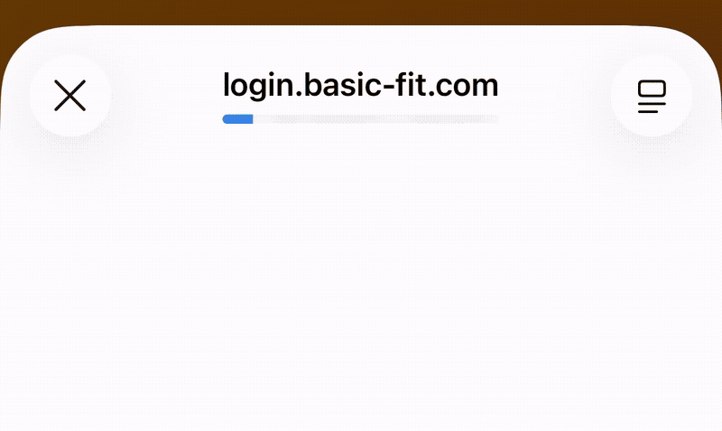

# Gym QR Generator

**Gym QR Generator** is a free, open-source web app (PWA) to generate your **gym access QR code**.
No need for the official app — access your gym quickly, even without an internet connection. Compatible with **iPhone**, **Android**, PC and Mac.

## Features

- **QR Code Generation**: Creates a valid QR code that refreshes automatically every 5 seconds.
- **Multi-Profile**: Save multiple accounts (family, friends) and switch between them easily.
- **PWA Mode**: Installable as an app on your phone (Android/iOS) for offline and quick access.
- **Themes**: Supports light and dark mode.
- **Fullscreen**: Ideal for scanning at the gate — just tap the QR code.
- **Favorites**: Set a default profile that loads automatically on startup.

## Requirements

You need two pieces of information linked to your your gym account:
1. **Card Number** (`card-Number`)
2. **Device ID** (`deviceID`)

## How to get your info

1. **Log out**: On the device that normally uses the gym app, log out of your account.
2. **Login page**: Open the login page by clicking "Login".
3. **Copy the URL**: On the login popup, long-press the address bar and select "Copy".

   

4. **Use the info**:
   - **Option A (Easy)**: Paste the full URL directly into the "Login via URL (Magic Link)" field. The site will fill in your info automatically.
   - **Option B (Advanced)**: Paste the URL into a note and manually extract:
     - `card-Number=` (e.g. `V123456789`)
     - `deviceID=` (e.g. `8d20fc96-...`)

*Note: This information is personal — do not share it.*

## Local Installation

This is a static web app made of plain HTML, CSS and JavaScript.

1. Download the project files.
2. Open `index.html` in your browser.
3. Enter your info and generate your QR code.

## Mobile Installation (PWA)

**iOS (Safari)**:
1. Open the site in Safari.
2. Tap the Share button (square with an arrow).
3. Select "Add to Home Screen".

**Android (Chrome)**:
1. Open the site in Chrome.
2. Tap the menu (3 vertical dots).
3. Select "Install app" or "Add to Home Screen".
